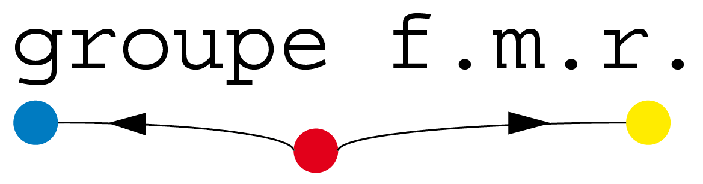

# Manipulations et combinaisons avec `igraph` 

Ce script actualise le contenu du billet  du blog fmr : [Combinaisons de graphes avec `igraph`](http://groupefmr.hypotheses.org/4097).

Il présente différentes fonctions permettant de manipuler son objet `igraph` (orientation des liens, suppression des boucles et des liens multiples) puis de combiner deux réseaux partageant *a minima* un sommet commun.

Liste des fonctions évoquées :

- `reverse_edges`
- `contract`
- `simplify`
- `simplify_and_colorize`
- `graph.complementer`
- `graph.difference`
- `graph.intersection`
- `graph.disjoint.union`
- `graph.union`

[https://beauguitte.github.io/Manipulations-et-combinaisons-avec-igraph/](https://beauguitte.github.io/Manipulations-et-combinaisons-avec-igraph/)


---
title: "Combiner des réseaux avec igraph"
format: html
author: "Laurent Beauguitte, groupe fmr"
date: mai 2023
editor: visual
---

*Actualisation d'un billet de juin 2015 posté sur [https://groupefmr.hypotheses.org](https://groupefmr.hypotheses.org)*

Ce tutoriel décrit les fonctions d'`igraph` permettant de manipuler un réseau (simple ou non) et de combiner deux réseaux ayant *a minima* un sommet commun.

## Manipuler un réseau simple

*Rappel : en théorie des graphes, un réseau simple est un réseau sans boucle ni liens multiples.*

Soit un réseau simple orienté. La fonction `reverse_edges()` inverse l'orientation des liens. Tous les attributs sont conservés. J'avoue ne pas trop savoir dans quel contexte on peut être amené à utiliser cette fonction.

Plus intéressante peut-être, la fonction `contract` permet d'agréger différents sommets en fonction d'un attribut. Ces derniers peuvent dans certains cas être conservés.

```{r}
#| warning: false
library(igraph)

# réseau orienté minimal
d1 <- rbind(c("A","B"),c("B","C"), c("C","D"))

# transformation en objet igraph
g1 <- graph.data.frame(d1, directed = TRUE)

# changement de l'orientation des liens
g1inv <- reverse_edges(g1)

plot(g1)
plot(g1inv)
```

```{r}
#| warning: false
#| echo: false
rm(d1, g1, g1inv)
```

```{r}
#| warning: false
# réseau où les sommets ont un attribut qualitatif (3 modalités)
d1 <- as.data.frame(rbind(c("A","B"),c("B","C"), c("C","D"), c("D","E"), c("E","C")))
names(d1) <- c("Som1","Som2")

d2 <- as.data.frame(rbind(c("A", "a"),
            c("B", "a"),
            c("C", "b"),
            c("D", "c"),
            c("E", "c")))
names(d2) <- c("name", "attribut")

g1 <- graph.data.frame(d1, d2, directed = FALSE)
g1

# contraction en fonction de l'attribut2
g1c <- contract(g1,
                mapping = factor(V(g1)$attribut),
                vertex.attr.comb = function(x) levels(factor(x)))

g1c
plot(g1c)

#| warning: false
#| echo: false
rm(d1, d2, g1, g1c)
```

Le réseau contracté conserve les attributs sous forme de listes. Par contre, il contient des boucles et des liems multiples. Ce qui permet d'examiner la fonction `simplify`.

## Boucles et liens multiples

Pourquoi simplifier le réseau ? Tout simplement parce que plusieurs fonctions d`igraph` donnent des résultats erronés si le graphe contient des boucles et/ou des liens multiples. La fonction `simplify` permet de transformer ces réseaux en réseaux simples. La fonction `simplify_and_colorize` permet de garder en mémoire l'existence de ces boucles et liens multiples.

```{r}
# manipulation d'un réseau avec boucle et liens multiples
d1 <- rbind(c("A","A"),
            c("A","B"),
            c("B","C"), 
            c("B","C"), 
            c("B","C"), 
            c("C","D"), 
            c("C","D"))


g1 <- graph.data.frame(d1, directed = FALSE)
g1

is.loop(g1)
is.multiple(g1)

plot(g1)

degree(g1)
```

La fonction `degree` donne un résultat satisfaisant. A a un degré de 3 : un lien avec B et une boucle. Par convention, une boucle est considéré comme un lien entrant plus un lien sortant et le degré d'une boucle est donc toujours supérieur ou égal à 2.

Par contre, la densité donne un résaltat non satisfaisant. Il considère qu'il y a 4 liens présents et 12 liens possibles (4/12 = 0.33). Or, le nombre de liens possibles est de 16 (si on considère que des boucles peuvent être partout présentes), voire de 28 (3 liens possibles entre chaque paire de sommets donc 4 fois 9, plus 4 boucles).

Ceci s'explique aisément, l'approche standard en analyse de réseau avec ce type d'objet est de commencer par supprimer boucles et liens multiples.

```{r}
# Par défaut, simplify supprime boucles et liens multiples
g1_2 <- simplify(g1)
plot(g1_2)

# Si je veux garder les liens multiples
g1_3 <- simplify(g1, remove.multiple = FALSE)
plot(g1_3)

# Si je veux garder une trace des boucles et des liens multiples
g1_4 <- simplify_and_colorize(g1)
g1_4

V(g1_4)$color # il y avait une boucle au premier sommet
E(g1_4)$color # il y avait 1 lien, 3 liens, 2 liens

```

```{r}
#| warning: false
#| echo: false
rm(d1, g1, g1_2, g1_3, g1_4)
```

## Combiner deux réseaux

Soit deux petits réseaux non orientés ayant trois sommets (A, C, D) et deux liens (AC, AD) en commun.

```{r}
#| warning: false

# Création des deux réseaux
d1 <- rbind(c("A","B"),c("A","C"), c("B","C"), c("A","D"), c("D","E"))
d2 <- rbind(c("A","F"), c("A","D"), c("A","C"), c("C","I"))

g1 <- graph.data.frame(d1, directed = FALSE)
g2 <- graph.data.frame(d2, directed = FALSE)

# visualisation
par(mfrow = c(1,2))
plot(g1, vertex.color = "yellow", vertex.size = 30, main = "g1")
plot(g2, vertex.color = "yellow", vertex.size = 30, main = "g2")
```

```{r}
#| echo: false
#| warning: false
#| results: hide
dev.off()
```

J'ajoute des attributs à ces deux réseaux : le degré des sommets, l'intermédiarité des liens et la densité du réseau.

```{r}
V(g1)$degree <-  degree(g1)
V(g2)$degree <- degree(g2)

E(g1)$between <- edge.betweenness(g1)
E(g2)$between <- edge.betweenness(g2)

g1$densite <- graph.density(g1)
g2$densite <- graph.density(g2)
```

La fonction `graph.complementer` permet de créer le graphe complémentaire (ou graphe inverse) d'un graphe. Le graphe complémentaire $G'$ du graphe $G$ a les mêmes sommets et deux sommets de $G'$ sont adjacents si et seulement si ils ne sont pas adjacents dans $G$. Ceci peut être utile quand on étudie des réseaux denses pour mettre en évidence l'**absence de relation**.

Les attributs des sommets et du graphe sont conservés, même si certains sont désormais faux (degré des sommets par exemple) ; les attributs des liens sont bien entendu perdus.

```{r}

compg1 <- graph.complementer(g1, loops = FALSE)
plot(compg1)

V(compg1)$degree
compg1
```

La fonction 'graph.difference' prend comme arguments les deux réseaux à prendre en compte : seuls les liens présents uniquement dans le premier réseau sont conservés. Tous les attributs de ce premier réseau le sont également.

```{r}
diffg1 <- graph.difference(g1, g2)
diffg1

diffg2 <- graph.difference(g2, g1)

# coordonnées (quasi) identiques pour faciliter la comparaison
lay <- layout.fruchterman.reingold(g1)

# lien A-D présent dans g1 et g2 donc g1-g2 et g2-g1 entrainent sa disparition
par(mfrow = c(2,2))
plot(g1, main = "g1", layout = lay, vertex.color = "red", vertex.size = 20, vertex.label.dist =3)
plot(g2, main = "g2", layout = lay, vertex.color = "red", vertex.size = 20, vertex.label.dist =3)

plot(diffg1, main = "graph.difference(g1, g2)", layout = lay, vertex.color = "red", vertex.size = 20, vertex.label.dist =3)
plot(diffg2, main = "graph.difference(g2, g1)", layout = lay, vertex.color = "red", vertex.size = 20, vertex.label.dist =3)
```

```{r}
#| echo: false
#| warning: false
#| results: hide
dev.off()
```

Après transformation, certains des attributs conservés peuvent être devenus faux et il est donc nécessaire de les recalculer (densité, degré, intermédiarité des sommets et/ou des liens, etc.).

```{r}
# calculer degré actualisé
V(diffg1)$degree2 <- degree(diffg1)
V(diffg1)$degree
V(diffg1)$degree2
```

La fonction `graph.intersection` prend en arguments deux réseaux et crée un réseau contenant les liens communs aux deux réseaux. Les attributs des sommets et des liens communs sont conservés. Il est possible de conserver ou d'éliminer les sommets devenant isolés suite à l'pération.

```{r}
# liens communs à deux graphes : conserve les attributs
# tous les sommets sont conservés (opérateur %s%)
interg1 <- graph.intersection(g1,g2, keep.all.vertices = TRUE)

# seuls sommets adjacents aux liens communs sont gardés (ici ACD)
interg2 <- graph.intersection(g1,g2, keep.all.vertices = FALSE)

par(mfrow = c(1,2))
plot(interg1, sub = "graph.intersection(g1,g2,\nkeep.all.vertices = TRUE)")
plot(interg2, sub = "graph.intersection(g1,g2,\nkeep.all.vertices = FALSE)")

```

```{r}
#| warning: false
#| echo: false
#rm(list=ls())
```

La fonction `graph.disjoint.union` (`disjoint_union`) permet de créer un graphe à partir de deux graphes différents. Les attributs respectifs des deux graphes sont conservés, avec des valeurs `NA` si un attribut est présent dans un graphe et absent dans l'autre. Les noms des sommets doivent être différents dans les deux réseaux. Enfin, les deux réseaux doivent être de même type en ce qui concerne l'orientation des liens : les deux doivent être orientés ou non-orientés.

```{r}
# création d'un réseau autre avec un attribut sur les sommets
d3 <- rbind(c("i","j"),c("j","k"), c("i","k"), c("k","l"), c("l","m"))
s3 <- data.frame(rbind(c("i","1"), c("j","1"), c("k", "2"), c("l",  "2"), c("m","1")))
names(s3) <- c("ID", "Attribut1")
g3 <- graph.data.frame(d3, s3, directed = FALSE)

# union de g1 et g3
gu <- graph.disjoint.union(g1, g3)

# attribut présent pour certains sommets seulement
V(gu)$Attribut1

```

```{r}
#| echo: false
#| results: hide
dev.off()
```

La fonction `graph.union` crée un réseau où tous les liens présents dans au moins un des réseaux de départ sont conservés. Tous les attributs sont conservés. Si deux attributs portent le même nom, un suffixe '\_1', '\_2`etc. est ajouté (voir l'attribut`degree\` ci-dessous). Comme avec la fonction précédente, les deux réseaux doivent être tous deux orientés ou non orientés. Par contre, il n'existe pas d'option pour créer un réseau valué à l'aide de cette opération.

<!-- vérifier si option pour valuer les liens-->

```{r}

uniong <- graph.union(g1,g2) 

```

Il existe également la fonction `compose`. Là encore, à la lecture de la documentation, je ne sais pas trop à quelle occasion elle est utile. Elle crée un sommet $ab$ seulement s'il existe un lien $ac$ dans le premier réseau et un lien $cb$ dans le deuxième.

